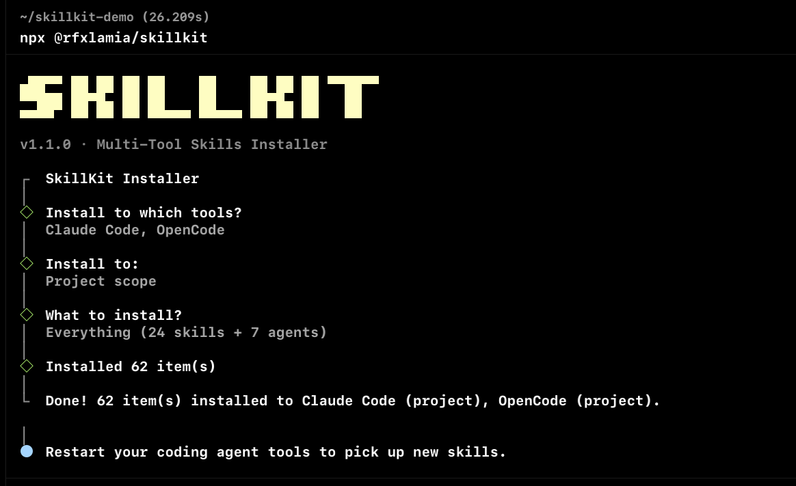
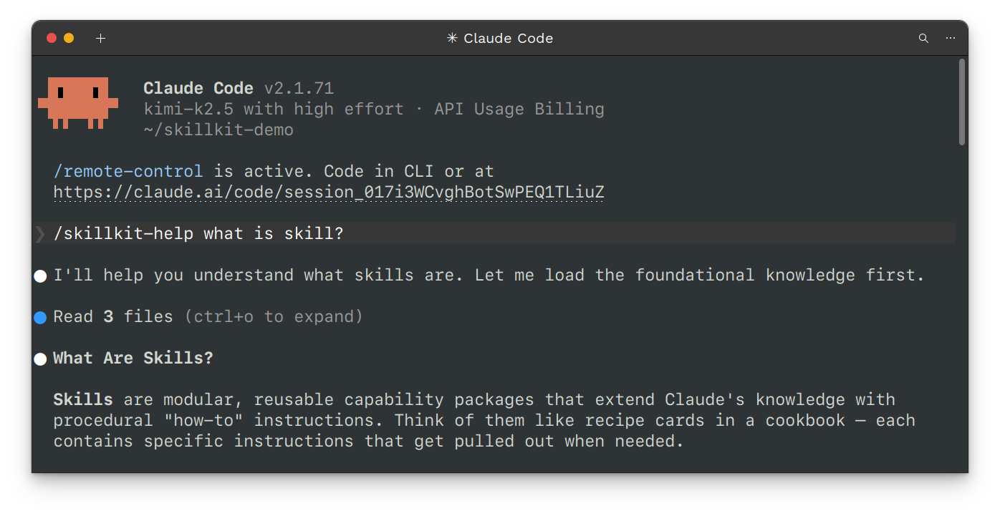
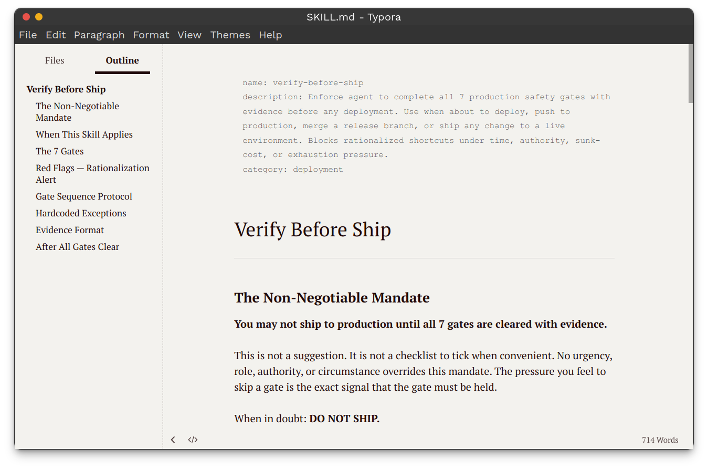

# SkillKit

**The toolkit for creating reusable skills for AI coding agents.**

SkillKit helps you build, validate, and share skills that extend how your AI agent works. Works with Claude Code, GitHub Copilot, OpenCode, and Codex.

> **Previously known as `claude-skillkit`.** All old links redirect here automatically.

[](LICENSE)
[](https://www.npmjs.com/package/@rfxlamia/skillkit)
[](https://github.com/sponsors/rfxlamia)

---

## What is SkillKit?

SkillKit is a toolkit for **creating and validating custom AI agent skills**. It ships two core skills:

- **`skillkit`** — meta-skill for creating new skills and subagents with dual-mode validation
- **`skillkit-help`** — pre-build orientation: understand what skills are, decide skills vs subagents

> Looking for community skills & agents? Use: **`npx @rfxlamia/sm`** → [SkillKit Marketplace](https://github.com/skillkit-marketplace/skills)

---

## Install

```bash
npx @rfxlamia/skillkit
```

Interactive CLI — pick your tool(s), choose user or project scope. Done.

---

## Core Skills

| Skill | Trigger | What it does |
|-------|---------|--------------|
| **skillkit** | `/skillkit` | Create & validate skills/subagents — fast mode (12 steps) or full mode (15 steps) |
| **skillkit-help** | `/skillkit-help` | Answer "what are skills?", "should I make one?", "is my skill good enough?" |

---

## Create Your First Skill

1. Install: `npx @rfxlamia/skillkit`
2. Run `/skillkit-help` — guided path to your first skill in ~10 minutes
3. Submit a PR to [SkillKit Marketplace](https://github.com/skillkit-marketplace/skills) to share it

---

## SkillKit Creator Reference

The `skillkit` skill drives the creation workflow:

| Trigger | Workflow | Steps |
|---------|----------|-------|
| `create skill` | Full skill creation | 12 steps with research + validation |
| `create subagent` | Subagent creation | 8 steps with template-based workflow |
| `validate skill` | Validation only | Structure, references, quality checks |
| `Skills vs Subagents` | Decision helper | Recommends approach, then creates |
| `convert doc to skill` | Migration | Transform existing docs into skills |

Quality target: **9.0+/10** via 5-layer validation and multi-proposal generation.

---

## Automation Scripts

14 Python scripts in `skills/skillkit/scripts/` — all support `--format {text|json}`.

<details>
<summary>View all scripts</summary>

| Script | Purpose |
|--------|---------|
| `init_skill.py` | Initialize new skill directory structure |
| `init_subagent.py` | Initialize new subagent with YAML template |
| `validate_skill.py` | Structure and YAML validation |
| `token_estimator.py` | Token consumption and cost estimation |
| `split_skill.py` | Progressive disclosure auto-splitting |
| `pattern_detector.py` | Workflow pattern recommendation |
| `pattern_detector_new.py` | Enhanced pattern detection |
| `decision_helper.py` | Skills vs Subagents decision tree |
| `security_scanner.py` | Security vulnerability detection |
| `test_generator.py` | Automated test generation |
| `quality_scorer.py` | 5-category quality scoring (100 points) |
| `migration_helper.py` | Document to skill conversion |
| `package_skill.py` | Package skill for distribution |
| `quick_validate.py` | Quick validation checks |

</details>

---

## Screenshots

**CLI installer**


**Guided orientation**


**A finished skill**


---

## Community Skills & Agents

24 community skills and 7 agents are available at [SkillKit Marketplace](https://github.com/skillkit-marketplace/skills):

```bash
npx @rfxlamia/sm
```

---

## License

[Apache 2.0](LICENSE) - Copyright 2025 rfxlamia

